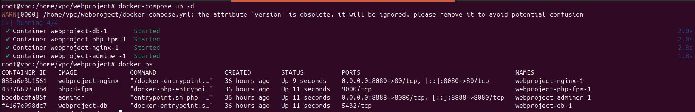
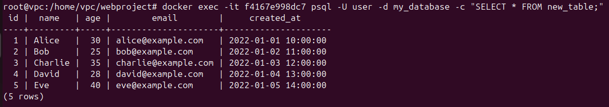
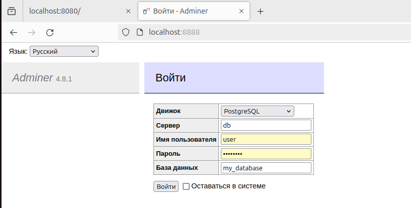
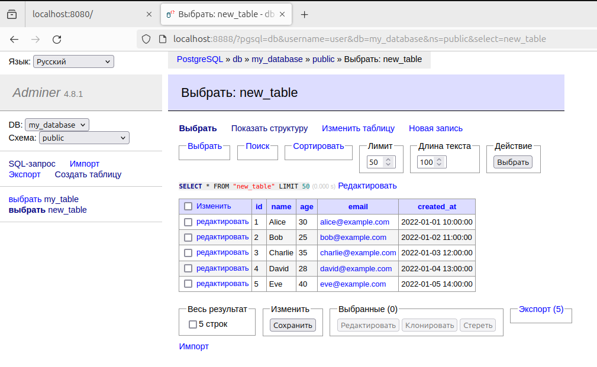
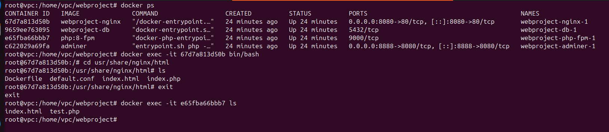
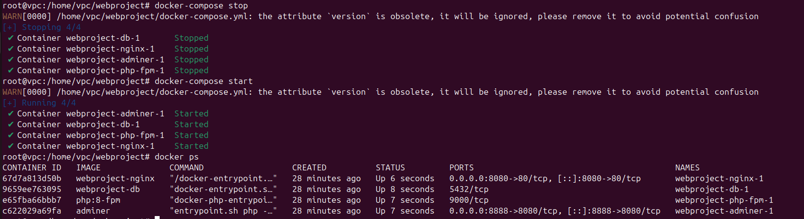

# Docker Compose and Docker Swarm

## Docker Compose

DC allows you to manage multiple containers from a single yml file.

Using this tool, there is no need to write multiple docker runs along with a bunch of arguments
that inflate the launch of a single container to several lines. DC is a tool that is part of the docker.

The difference between Docker and Docker Compose is that docker is designed to manage single containers that an application can consist of. DC also allows you to manage several containers at once, starting and stopping them in one command. In fact, DC offers the same features as docker, but at the same time, it allows you to work with more complex applications with complex internal architecture and components.

For example, we need to launch a database, front-end, connect payment or mail services. To do this, we will need several containers. one working copy of each component will definitely not be enough. Let's not forget about heavy server loads, fault tolerance, testing of new versions, etc., etc. Here we can run various test versions of the site with all components, versions of the site for various devices can work (mobile version, tablet version, desktop version, and so
on).

So, let's imagine that our service has become so popular that the capacity of the server on which it runs has become insufficient. You will have to migrate and reconfigure at least some of the services. In order to move a project or part of it to a new location, you need to make a number of settings, download a backup copy of the database and generally recall the procedure for deploying these components.

If we don't have a docker, but a DC, everything is much simpler. And the issue of transferring the service will be much easier due to the fact that all commands will be documented in YML files. All we need to do is run one command and upload the necessary data set to a new server, for example, a database.

So let's move on to an example. Suppose we need to run:

- frontend
- a database and an Aminer for working with it.

## Step 1: Create a project directory

Open the terminal and create a new directory for your project:

```
root@vpc:/home/vpc#  mkdir webproject
root@vpc:/home/vpc# cd webproject
```

We will also need a php folder to define the php-fpm service build, an nginx folder to configure the server build, and a db folder.

```
root@vpc:/home/vpc/webproject# mkdir php nginx db
```

## Step 2: In the root directory of the project (my_project), create a docker-compose.yml file:

```
root@vpc:/home/vpc# touch docker-compose.yml
```

Add the following content to the [docker-compose.yml file](./docker-compose.yml)

As you can see from the file, we use a common network for the interaction of all services - my_network. This is useful when you need to connect to a service from another container.

Describe the work of the services and the contents of their configurations

### Nginx

Nginx is used as a reverse proxy to route requests to the appropriate service.

Php-fpm is used to run PHP scripts. It is important to note that the container is created with the -d flag, which means that it will run in the background. This is necessary to ensure that the container does not stop when the script ends.

Using the [dockerfile](./nginx/Dockerfile), we describe that a text editor should be installed in the container to work with files, copy the Nginx configuration file ([default.conf](./nginx/default.conf)) inside the container, copy the file [index.php](./nginx/index.php) inside the container, we determine the port that will be opened in the container, and also use the command to run nginx inside the container at startup.

Default.conf is a configuration for the Nginx web server that defines how to process requests to the web application. Let's take a closer look at what each part of this configuration does:

- server { ... }: Defines a configuration block for the Nginx web server that will listen on port 8080 and process requests.
- listen 8080;: Indicates that the server should listen on port 8080 for incoming requests.
- server_name localhost;: Sets the server name to be used when processing requests from the "localhost" host.
- location / { ... }: Defines the settings for processing requests to the root URL.
- root /usr/share/nginx/html;: Specifies the path to the root directory where the files for processing requests will be located.
- index index.php index.html ;: Sets the priority order of the index files to be used if they are present in the requested URL.
- try_files $uri $uri/ /index.php?$args;: Specifies the priority order of the files to be used when processing requests. If the requested URL does not match any of the files, the server will try to find the file in the root directory. If it is not found, it will return the file index.php.
- location ~ .php$ { ... }: Defines the settings for processing requests to PHP files.
- include fastcgi_params;: Includes a file with FastCGI parameters required for processing PHP scripts.
- fastcgi_pass php-fpm:9000;: Indicates the address and port on which PHP-FPM is running to send processing requests to PHP scripts.
- fastcgi_param SCRIPT_FILENAME $document_root$fastcgi_script_name;: Sets the path to the PHP script to be processed.
- fastcgi_param QUERY_STRING $query_string;: Sets the query string to be passed to the PHP script.

Index.php is a simple PHP script that is used to display the contents from the database. It is important to note that the script is located in the root directory of the container.

This script establishes a connection to the PostgreSQL database, executes a query to the new_table table, extracts data from the query result and displays it on the screen. In case of an error when executing a query or connecting to the database, an error message is displayed.

This PHP script performs the following actions:

- Setting the database connection parameters:

  - Sets the values of variables to connect to the PostgreSQL database.
  - $host sets the name of the database service in Docker Compose.
  - $dbname indicates the name of the database.
  - $user and $password represent the credentials for connecting to the database.

- Connecting to the database:

  - A new instance of the PDO class is created, which represents a connection to the PostgreSQL database.
  - Error handling mode is set to throw exceptions when errors occur.

- Executing an SQL query:

  - The SQL query SELECT \* FROM new_table to the new_table table is executed.
  - The result of the query is processed in a while loop, extracting each row of the result and displaying information about it.

- Output of results:

  - Information such as ID, name, age, email, and creation date is displayed for each row of the result.

- Exception handling:
  - In case of an exception of the PDOException type (error when connecting to the database), an error message is displayed.

### PHP-FPM

This service is designed for processing PHP scripts.

It contains two Dockerfile files to create a container configuration and install the necessary software, copies some configuration, and also installs a working directory.

The applications used here are:

- The list of packages is updated and the necessary dependencies for working with images are installed (for example, libfreetype6-dev, libjpeg62-turbo-dev, libpng-dev).
- The GD extension is configured to work with images, specifying the paths to the freetype and jpeg libraries.
- The GD and PDO extensions for working with MySQL databases are installed.

### PostgreSQL

This service is used to store data.

Postgresql is used as the database, which is defined in the Dockerfile and Adminer is used for convenient operation. When you launch the Adminer container and push the port using ports: - "8888:8080", this means that port 8080 inside the Adminer container will be accessible via port 8888 on the host system (outside the container).

Thus, when you access port 8888 on your host system, requests will be redirected to port 8080 inside the Adminer container, where Adminer accepts and processes these requests.

Also, the configuration for the backup is specified in docker-compose and a script [backup.sh](backup.sh)has been prepared for it. This feature is still in development.

## Step 3: Launch the project

To launch the project, run the following command:

```
root@vpc:/home/vpc/webproject# docker-compose up
```

This command will start all the containers in the background.

Let's see if the connetainers are really running:

```
root@vpc:/home/vpc/webproject# docker ps
```



We can go into the database container and view the contents of the table that I created earlier using an SQL query:

```
root@vpc:/home/vpc/webproject# docker exec -it f4167e998dc7 psql -U user -d my_database -c "SELECT * FROM new_table;"

```



Now let's go into the browser and log into the database using Adminer by entering the credentials specified in docker-compose.yml:



Let's look at the contents of the new_table:



Let's also look at the nginx container and its directory for storing files:



As you can see, the container IDs have changed since I had to stop the containers using the command:

```
root@vpc:/home/vpc/webproject# docker-compose down
```

However, if you do not need to delete these resources, then you need to use the docker-compose stop command, which stops all containers started using docker-compose up, but does not delete them:



This time the IDs remained the same.
