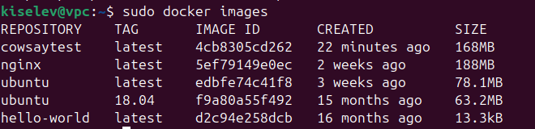

# Dockerfiles and layers

## Introduction

Containers and images consist of layers. Each separate layer, except the top one (which is also the last one), has a read-only access mode. Also, the Dockerfile describes not only information about what should be in the image, but also in what sequence this “something" should be added.

Each layer is just a file that describes the next change in the image state compared to the one that was in the previous iteration.


This is how the most common image looks. Ubuntu OS is the basis of the image, and then there are the rest of the instructions that form the layer. It is also worth noting that all layers except the last one are connected to the image in read-only mode. The upper one (also known as the last one) is available in the mode “read-write”.

At the very beginning, it is necessary to insert arguments that are not planned to be changed in the future, or changes are extremely rare. This will save some time in the process of reassembling the container.

If the layer has not changed, the image simply will not rebuild this layer. The higher the modified layer, the fewer additional reassemblings there will be.

Let's describe the most important commands (arguments) that are used when creating an image:

- FROM: This is the first line of the Dockerfile. It is used to specify the base image.
- COPY: This is used to copy files from the host machine to the image.
- RUN: This is used to run commands
- ADD: This is used to copy files from the host machine to the image.
- CMD: This is used to specify the command that will be executed when the image is run.
- ENV: This is used to set environment variables.
- LABEL: This is used to add metadata to the image.
- EXPOSE: This is used to specify the port that will be exposed to the outside.
- VOLUME: This is used to create a volume.
- WORKDIR: This is used to set the working directory.
- USER: This is used to set the user.
- ARG: This is used to set a variable.
- ONBUILD: This is used to specify the command that will be executed when the image is built from another image.
- HEALTHCHECK: This is used to set the health check.
- ENTRYPOINT: This is used to set the entry point of the container.

### Instructions FROM

The FROM instruction is used to specify the base image. The FROM instruction is the first instruction in the Dockerfile. It is used to specify the base image.

It is necessary to specify specific versions in the process of work, so that for sure nothing breaks and works the way we want. It is the image of the specified version that will be used in the image creation process. Again, if no tag is included, then the system will assume that we need the latest version of the image.

If there is no image required for assembly on the local machine, the system will automatically download the layers necessary for the image to work.

The FROM instruction has the following format:

FROM <image>:tag

The FROM instruction can be used in two ways:

- The image name is specified directly.
- The image name is specified with the tag.

### Instructions COPY

The COPY instruction is used to copy files from the host machine to the image. The COPY instruction is used to copy files from the host machine to the image.

If suddenly the directory to which we copy the data is missing, then the instruction will create it.
An example of using the instruction looks like this:

```
COPY . ./test123
```

Important explanation: the copy will be made from the current folder where the dockerfile is located. In this case, everything that is inside the folder will be copied.

The COPY instruction has the following format:

COPY <source> <destination>

The COPY instruction can be used in two ways:

- The source is specified directly.
- The source is specified with the path.

### Instructions RUN

The RUN instruction is used to run commands. The RUN instruction is used to run commands.

The simplest usage example looks like this:

```
RUN apt update
RUN apt upgrade
RUN apt install openssh
```

Following this instruction tells the system that it is necessary to find updated packages for further use on the base image and install the updated openssh at the same time.

The RUN instruction has the following format:

RUN <command>

The RUN instruction can be used in two ways:

- The command is specified directly.
- The command is specified with the path.

### Instructions ADD

The ADD instruction is used to copy files from the host machine to the image. The ADD instruction is used to copy files from the host machine to the image.

With this feature, for example, you can add files downloaded from remote sources and, as
previously mentioned, unpack local ones.tar files.

The usage example looks like this:

```
ADD
https://github.com/mazzahaker/test-lesson-jenkins/blob/main/pipel
ine /testdir123
```

In this use case, the instruction downloaded a file located remotely and added it to a directory inside the container.

The ADD instruction has the following format:

ADD <source> <destination>

The ADD instruction can be used in two ways:

- The source is specified directly.
- The source is specified with the path.

### Instructions CMD

The CMD instruction is used to specify the command that will be executed when the image is run. The CMD instruction is used to specify the command that will be executed when the image is run.

Important note: The results of executing this command are not added to the image during its build.

It is also worth noting that only one CMD instruction can be present in one dockerfile. If suddenly the file contains several such instructions, the system will ignore all but the last one.

It is also customary to place this instruction at the very end of the file, which is logical, since it ends the description of our dockerfile. In fact, we end it with instructions on how to launch our software.
Another interesting note: the arguments entered on the command line, which are passed when starting docker run, override all the startup arguments that are provided in the docker file.

Usage example:

```
CMD ["python", "./testscript.py"]
```

In this case, the python script will be executed when the image is run.

The CMD instruction has the following format:

CMD <command>

The CMD instruction can be used in two ways:

- The command is specified directly.
- The command is specified with the path.

### Instructions ENV

The ENV instruction is used to set environment variables. The ENV instruction is used to set environment variables.

This instruction is great when you need to use constants inside a container. For example, you can use these variables if , when describing commands executed in a container, one or another variable is used repeatedly. It is worth using, firstly, from the point of view of convenience, and secondly, from the point of view of code reuse. Sooner or later, this variable may have to be changed. It is much more convenient to change the value of one variable than to do the same thing many times in different parts
of the code.

A simple usage example looks like this:

```
ENV NAME="Mazda"
ENV ADMIN="mazzahaker"
```

The ENV instruction has the following format:

ENV <variable> <value>

The ENV instruction can be used in two ways:

- The variable is specified directly.
- The variable is specified with the path.

### Instructions LABEL

The LABEL instruction is used to add metadata to the image. The LABEL instruction is used to add metadata to the image.

Example of using the instruction:

```
LABEL maintainer="hack-me@list.ru"
```

The LABEL instruction has the following format:

LABEL <key> <value>

The LABEL instruction can be used in two ways:

- The key is specified directly.
- The key is specified with the path.

### Instructions EXPOSE

The EXPOSE instruction is used to specify the port that will be exposed to the outside. The EXPOSE instruction is used to specify the port that will be exposed to the outside.

The EXPOSE instruction has the following format:

EXPOSE <port> <port>...

The EXPOSE instruction can be used in two ways:

- The port is specified directly.
- The port is specified with the range.

### Instructions VOLUME

The VOLUME instruction is used to create a volume. The VOLUME instruction is used to create a volume.

The VOLUME instruction has the following format:

VOLUME <volume>

The VOLUME instruction can be used in two ways:

- The volume is specified directly.
- The volume is specified with the path.

### Instructions WORKDIR

The WORKDIR instruction is used to set the working directory. The WORKDIR instruction is used to set the working directory.

The WORKDIR instruction has the following format:

WORKDIR <directory>

The WORKDIR instruction can be used in two ways:

- The directory is specified directly.
- The directory is specified with the path.

### Instructions USER

The USER instruction is used to set the user. The USER instruction is used to set the user.

The USER instruction has the following format:

USER <user>

The USER instruction can be used in two ways:

- The user is specified directly.
- The user is specified with the path.

### Instructions ARG

The ARG instruction is used to set a variable. The ARG instruction is used to set a variable.

The ARG instruction has the following format:

ARG <variable>

The ARG instruction can be used in two ways:

- The variable is specified directly.
- The variable is specified with the path.

### Instructions ONBUILD

The ONBUILD instruction is used to specify the command that will be executed when the image is built from another image. The ONBUILD instruction is used to specify the command that will be executed when the image is built from another image.

The ONBUILD instruction has the following format:

ONBUILD <command>

The ONBUILD instruction can be used in two ways:

- The command is specified directly.
- The command is specified with the path.

### Instructions HEALTHCHECK

The HEALTHCHECK instruction is used to set the health check. The HEALTHCHECK instruction is used to set the health check.

The HEALTHCHECK instruction has the following format:

HEALTHCHECK <command>

The HEALTHCHECK instruction can be used in two ways:

- The command is specified directly.
- The command is specified with the path.

### Instructions ENTRYPOINT

The ENTRYPOINT instruction is used to set the entry point of the container. The ENTRYPOINT instruction is used to set the entry point of the container.

In fact, it is similar to CMD, however, the parameters set in entrypoint cannot be replaced with any
command-line parameters. That is, in any case, the command written to the dockerfile will be executed.

So let's make it a little clearer - when to use CMD, and when - ENTRYPOINT:
● If you need to run the same command over and over again every time you start the container, then you need to use ENTRYPOINT.
● If the container is used as an application (running a database, for example), you also need to use ENTRYPOINT.
● If we know that during container startup it is necessary to pass arguments to it that can overwrite the default arguments (change startup parameters, for example), use CMD.

Usage example:

```
ENTRYPOINT ["python", "test_var"]
```

In this case, the python script will be executed when the image is run.

On the one hand, in our example there is ENTRYPOINT. That is, the same thing will always run. Technically,
this cannot be changed. And it is so! At each startup, python will be executed, and it will run the executable file specified in the test_var variable. She appeared before us. And by default, this variable has a value - the name of the file that is contained locally. However, if we pass the appropriate value for the variable, formally, another file will be executed in the same container.

The ENTRYPOINT instruction has the following format:

ENTRYPOINT <command>

The ENTRYPOINT instruction can be used in two ways:

- The command is specified directly.
- The command is specified with the path.

## Creating your first container

install one application on the system - cowsay. This application will help us quite simply to figure out our own image and with its help, various kinds of experiments and comparisons will be carried out at the moment. The application simply outputs an image of a cow to the console with the phrase that we will enter into it.

Installing it is quite simple:

```
sudo apt install cowsay
```

And let's run it in the system, that is, without a container:

```
/usr/games/cowsay "Hi"
```


As we can see, the application is installed and ready to work. Now let's go directly to creating our dockerfile:

```
Kiselev@vpc:~$ touch Dockerfile
```

It will look like this:

```
FROM ubuntu:22.10
RUN apt-get update
RUN apt-get install -y cowsay
RUN ln -s /usr/games/cowsay /usr/bin/cowsay
CMD [“cowsay”]
```

The very first line (FROM...) is what is the first layer. He is the original layer. It is necessary to remember once again: in terms of Docker, this is the basic image (BO). It is sometimes called parental. BO is where the assembly of the docker image begins. You can choose absolutely anything, let's start
with ubuntu.

The second line leads to the installation of new software packages, updating existing ones.

The third is installing the cowsay app.

The fourth one creates a symbolic link so that you can launch the application not through calling the full path, but directly.

The dockerfile is ready. Let's “compile” it! To do this , go to the directory with the created file (show ls -l) and run the command:

```
Kiselev@vpc:~$ docker build -t cowsaytest .
```

Now let's check the correctness of the build. To do this, let's go inside the container (we already know how to do this):

```
Kiselev@vpc:~$ docker run -it cowsaytest bash
```

And check a number of files:

```
root@f1d4f4bf1dab:/# ps -aux
```

```
root@f1d4f4bf1dab:/# hostname
```


As you can see, we are inside the container. Let's try to launch our application manually (cowsay “Cowsay in container"). After executing the command, everything should start!


We exit the container into the host OS and launch our container from the created image:

```
kiselev@vpc:~$ sudo docker run cowsaytest cowsay "Hi"
```


As you can see, the application is launched in the container.

Now let's look at our images:

```
Kiselev@vpc:~$ docker images
```



We can see that the size of our current image is 168 MB. Let's reduce it! The easiest way to start is by reducing the number of layers. Let's fix our dockerfile:

```
FROM ubuntu
RUN apt-get update && \
apt-get install -y cowsay && \
ln -s /usr/games/cowsay /usr/bin/cowsay
RUN rm -rf /var/lib/apt/lists/*
CMD [“cowsay”]
```

As you can see, we have now combined several commands using the && symbol. This reduced the number of layers from five to three. At the same time, we have specially added a SEPARATE command to clear downloaded caches, which we no longer need. Let's check the result by running the container build:

```
Kiselev@vpc:~$ sudo docker build -t cowsaytest .
```

Now the system shows that we have 3 steps instead of five. Let 's take a look at the size. But he remained the same!


It would seem that we have made improvements, we tried to delete the caches, but the size does not change. Here you might think that everything was done in vain! However, this is not quite true. Now let's fix our dockerfile again:

```
FROM ubuntu
RUN apt-get update && \
apt-get install -y cowsay && \
ln -s /usr/games/cowsay /usr/bin/cowsay && \
rm -rf /var/lib/apt/lists/*
CMD [“cowsay”]
```

Now we have moved the cache cleanup to another layer. This command does not create a new layer, but works on the old one, in which the system created these caches. Due to being in different layers earlier, cache cleanup did not occur. This was due to the fact that each of the teams worked on different layers of the image. Now let's check it out!

Let's rebuild our container and look at the size:


The previous container weighed 168 MB, and our current one is 128 MB. This is progress! However, it's still too much for a simple application that initially weighs about 5 MB.

However, the next step for a possible change in size (or rather, reduction) is to change the base image. Initially, this is a big mistake for beginners: we used the basic image of the system that everyone knows, however, it is necessary to use more lightweight images for assembly. For example, alpine.

Let's check it out:

```
FROM alpine
RUN apt-get update && \
apt-get install -y cowsay && \
ln -s /usr/games/cowsay /usr/bin/cowsay && \
rm -rf /var/lib/apt/lists/*
CMD [“cowsay”]
```

Let's assemble the image:

```
Kiselev@vpc:~$ sudo docker build -t cowsaytest .
```


We're trapped! Different package managers are used for each base image. It depends on the distribution of the operating system that is contained in the BO. Usually the description contains information about
the BO. If not, you can get it yourself. For example, using the command
uname.

Let's fix our dockerfile again:

```
FROM alpine
RUN apk update && apk add --no-cache cowsay \
    --repository https://alpine.global.ssl.fastly.net/alpine/edge/community \
    --repository https://alpine.global.ssl.fastly.net/alpine/edge/main \
    --repository https://dl-3.alpinelinux.org/alpine/edge/testing && \
    rm -rf /var/cache/apk/*
CMD ["cowsay", "Hello, World!"]
```


Perfect! In our example, the size has decreased by 4 times.

We have studied and figured out the term “layers”, studied the architecture of the image and used examples to figure out the dependencies of the entered commands and layers. We also studied several basic ways to
reduce the size of the image.
