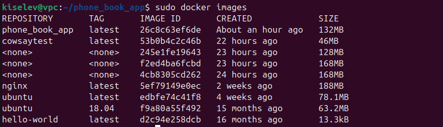
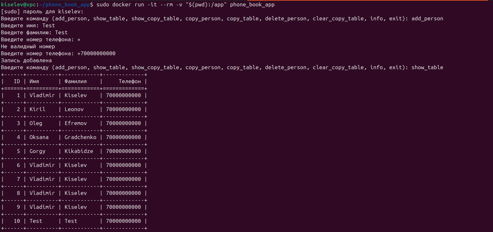

# Containerization of the application

Our task is to containerize any native application. Let it be an application from my Phone_book repository in Python: https://github.com/Vkiselev1984/phone_book/

As you can see from the description, we will also need the environment and the tabulate library.

Let's create a directory for our project and download the application from the repository there:

```
kiselev@vpc:~$ mkdir phone_book_app
kiselev@vpc:~$ cd phone_book_app
kiselev@vpc:~/phone_book_app$ git clone https://github.com/Vkiselev1984/phone_book.git
```

Then create a file named Dockerfile (without extension) in the same directory with the following contents:

```
# Use the official Python base image
FROM python:3.9-slim

# Install the working directory inside the container
WORKDIR /app

# Copy the dependency file and install the dependencies
COPY requirements.txt requirements.txt
RUN pip install --no-cache-dir -r requirements.txt

# Copy the Python script and CSV files to the container
COPY app.py app.py
COPY phone_data.csv phone_data.csv
COPY copy_phone_data.csv copy_phone_data.csv

# Set the command to launch the application
CMD ["python", "app.py"]
```

We already have the file requirements.txt with the specified dependencies, in particular the tabulate library. So we can use it to install the necessary libraries.

Run the build using the command:

```
kiselev@vpc:~/phone_book_app$ sudo docker build -t phone_book_app.
```

Let's check the creation of the image:

```
kiselev@vpc:~/phone_book_app$ sudo docker images
```



After assembling the image, we can launch the container:

```

kiselev@vpc:~/phone_book_app$ sudo docker run -it --rm -v "$(pwd):/app" phone_book_app

```

- The -it flag allows interactive access to the terminal.
- The --rm flag ensures that the container will be deleted after it is stopped.
- The -v flag "$(pwd):/app" mounts your current directory to the /app container directory, allowing the script to access CSV files created on the host.

When we launch the container, we will see a command prompt. Let's test the application:



The application is working, a new entry has been added and is shown in the phone directory table.
