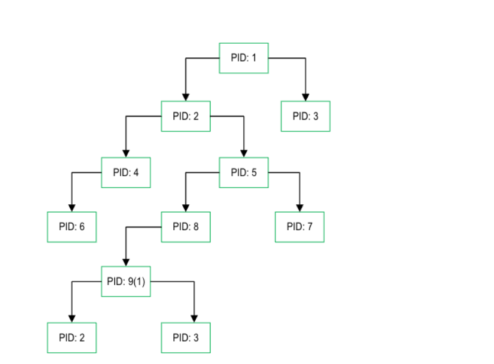

The file system of UNIX systems is a tree-like hierarchy:


The file system consists of directories, which in turn consist of files and subdirectories.
The root directory is the topmost directory in the file system.

By calling the chroot function, you can add a second root directory, which, from the point of view of user perception, will not differ in any way from the first one. Formally, when adding a second root directory, the file
structure will look like this:


In this case, the file system is divided into two components that do not affect each other in any way.
To dive into the procedure of changing the root directory, it is proposed to consider the description of the system call in BSD-Lite 4.4 OS in the vfs_syscall.c file:


## Practical analysis of the chroot call

Create directories and an executable file to change the root directory:

```
kiselev@vpc:~$ cd ..
kiselev@vpc:/home$ cd ..
kiselev@vpc:/$ sudo su
root@vpc:/# mkdir newroot
root@vpc:/# cd newroot
root@vpc:/newroot# touch vfs_syscall.c
root@vpc:/newroot# nano vfs_syscall.c
```

Code of the executable file:

```
#include <stdio.h>
#include <stdlib.h>
#include <unistd.h>
#include <string.h>

int main(int argc, char *argv[]) {
if (argc != 2) {
fprintf(stderr, "Usage: %s <new_directory>\n", argv[0]);
return 1;
}
const char *new_root = argv[1];
// Changing the root directory
if (chroot(new_root) != 0) {
perror("chroot failed");
return 1;
}
// Changing the current directory to the root directory
if (chdir("/") != 0) {
perror("chdir failed");
return 1;
}
printf("The root directory has been successfully changed to: %s\n", new_root);
return 0;
}
```

```
root@vpc:/newroot# gcc -o vfs_syscall vfs_syscall.c
root@vpc:/newroot# sudo ./vfs_syscall /newroot
The root directory has been successfully changed to: /newroot
```

### Copy the Bash shell

Copy the Bash shell to the new root folder, in which we create the bin folder:

```
root@vpc:/newroot# mkdir bin
root@vpc:/newroot# ls -all
итого 32
drwxr-xr-x 3 root root 4096 авг 8 11:12 .
drwxr-xr-x 27 root root 4096 авг 8 10:38 ..
drwxr-xr-x 2 root root 4096 авг 8 11:12 bin
-rwxr-xr-x 1 root root 16160 авг 8 10:41 vfs_syscall
-rw-r--r-- 1 root root 840 авг 8 10:41 vfs_syscall.c
root@vpc:/newroot# cd ..
root@vpc:/# cp /bin/bash /newroot/bin/
root@vpc:/# cd newroot
root@vpc:/newroot# cd bin
root@vpc:/newroot/bin# ls -all
итого 1424
drwxr-xr-x 2 root root 4096 авг 8 11:12 .
drwxr-xr-x 3 root root 4096 авг 8 11:12 ..
-rwxr-xr-x 1 root root 1446024 авг 8 11:12 bash

```

### Copying missing libraries

If we try to run the Bash shell we will get an error:

```
root@vpc:/# chroot newroot
chroot: failed to run command ‘/bin/bash’: No such file or
directory
```

The problem is different - the necessary libraries for running the executable file have not been found.
To view the list of required libraries, just run the command $ldd /bin/bash
Let's fix this by copying them from the main system to the lib and lib64 folders of the new root directory:

```
root@vpc:/newroot# mkdir lib
root@vpc:/newroot# mkdir lib64
root@vpc:/newroot# cp /lib/x86_64-linux-gnu/libc.so.6 /newroot/lib/
root@vpc:/newroot# cp /lib64/ld-linux-x86-64.so.2 /newroot/lib64/
root@vpc:/# cp /lib/x86_64-linux-gnu/libtinfo.so.6 newroot/lib
root@vpc:/# chroot newroot
root@vpc:/# chroot newroot
bash-5.2#
```

As we can see, now the “greeting” of the system for entering a command has become different. This means that we have isolated the process. In fact, we have launched an isolated shell of the bash command interpreter, with
a root different from the rest of the system.

Let's try to view the current directory using the ls command:

```
bash-5.2# ls
bash: ls: command not found
```

As before, you need to copy all the necessary executable files to the created folder along with the dynamic libraries.

First, you need to determine the path to the ls command executable file using the which command. This can be done as follows:

```
root@vpc:/# which ls
/usr/bin/ls
```

After you have found out the path to the executable file, the next step is to use the ldd command to get a list of dynamic libraries on which the ls command is based. You need to run the following command (assuming the path to ls is /usr/bin/ls):

```
root@vpc:/# ldd /usr/bin/ls
linux-vdso.so.1 (0x00007ffe82bac000)
libselinux.so.1 => /lib/x86_64-linux-gnu/libselinux.so.1 (0x00007e37f4397000)
libc.so.6 => /lib/x86_64-linux-gnu/libc.so.6 (0x00007e37f4000000)
libpcre2-8.so.0 => /lib/x86_64-linux-gnu/libpcre2-8.so.0 (0x00007e37f42fd000)
/lib64/ld-linux-x86-64.so.2 (0x00007e37f43f9000)
```

Copy these libraries to the new root directory

```
root@vpc:/# cp /lib/x86_64-linux-gnu/libselinux.so.1 /newroot/lib/
root@vpc:/# cp /lib/x86_64-linux-gnu/libpcre2-8.so.0 /newroot/lib/
root@vpc:/# cp /lib64/ld-linux-x86-64.so.2 /newroot/lib64/
```

Now let's check if it is possible to display a list of files in the Bash shell:

```
root@vpc:/# chroot newroot
bash-5.2# ls
bin  lib  lib64  vfs_syscall  vfs_syscall.c
bash-5.2# cd bin
bash-5.2# ls
bash  ls
```

### File system isolation

According to man unshare - Unshare the mount namespace indicates that using --mount the filesystem mount namespace is isolated.

As a result, for an isolated system, we can run the following command:

```
root@vpc:/# unshare --mount --root=newroot /bin/bash
bash-5.2#
```

## The mechanism of namespaces

A namespace is an abstraction in the Linux system in which system resources are located. The type of resource depends on the type of namespace. Namespaces are not some additional feature that can be installed or simply dispensed with. This entity is initially provided by the Linux OS kernel itself and is a necessary component
involved in the procedure for starting any process in the system. At any given time , any process can belong to only one namespace of each type. Namespace is also a mechanism for isolating processes from each other in UNIX systems.

Each individual namespace is independent. That is, we can do absolutely any procedure inside this space without affecting the rest.

Example: what happens if we execute the following command in our system?

```
sudo rm -rf /
```

After executing this command, the system will be seriously damaged and will not even be able to perform the boot procedure, since by executing this command, we will delete its root, and with it the system will lose file addressing.

If this command is executed inside an isolated namespace, only it will fail.

There are currently six namespace types available:

| Пространство имен                 | Что изолируется                            |
| --------------------------------- | ------------------------------------------ |
| PID                               | Process ID Isolation                       |
| Network                           | Network isolation (network, ports, stacks) |
| User                              | Isolation of users and groups              |
| Mount                             | Redefining mount points                    |
| IPC (Inter Process Communication) | Isolation of interprocess communication    |
| UTS (UNIX Time-Sharing)           | Isolation of the host name and domain name |

The PID is a process identification number that is commonly used by most operating system kernels such as Linux, Unix, macOS, and Windows. This is a unique identification number that is automatically assigned to each process when it is created in the operating system.

A process is an executable instance of a program.

### Practice

Each time, the process ID will receive changes to all processes except init, since init is always the first process in the system and is the ancestor of all other processes. This is PID – 1. The maximum value of PID in
32-bit systems is 32,768 by default.

To check this fact is quite simple: just run the following command:

```
cat /proc/sys/kernel/pid_max
4194304
```

### PID: Isolating process IDs

The PS command reports a snapshot of the current processes

```
root@vpc:/# ps
    PID TTY          TIME CMD
   5518 pts/3    00:00:00 sudo
   5519 pts/3    00:00:00 su
   5520 pts/3    00:00:00 bash
   6802 pts/3    00:00:00 ps
```

And the top command displays a list of all processes running in real time


The process tree is a hierarchical structure similar to the directory tree of a file system. Historically, there was support for only one process tree, since when creating the core and the system as a whole, there was no need to divide it: at least, hardware capacities did not allow, and there was no software justification for this either.



It is important to note that nested namespaces can be created: the main process starts a child in a new namespace, and any child, in turn, can generate a new namespace, and so on.

In this case, the clone() system call with the additional CLONE_NEWPID flag is used to create a namespace. With the help of such a flag this is how a new process is launched in the child namespace, forming a new subtree.

To test the theory, it is proposed to compile and run the following program code written on C:

```
root@vpc:/newroot# touch pid.c
root@vpc:/newroot# nano pid.c
```

Next, write the following code to the created file:

```
#define _GNU_SOURCE
#include <sched.h>
#include <stdio.h>
#include <stdlib.h>
#include <sys/wait.h>
#include <unistd.h>
static char child_stack[1048576];
static int child_fn() {
printf("PID: %ld\n", (long)getpid());
return 0;
}
int main() {
pid_t child_pid = clone(child_fn, child_stack+1048576,
CLONE_NEWPID | SIGCHLD, NULL);
printf("clone() = %ld\n", (long)child_pid);
waitpid(child_pid, NULL, 0);
return 0;
}
```

The described application allows you to display the PID of a process in a shared
tree, as well as, to make sure, the PID of a process in an isolated tree.
To compile, you will need the gcc compiler and the command:

```
gcc pid.c -o pid.sh
```

After executing this command, an executable file will appear in the same folder, ready for execution. At startup, you will receive the following output:

```
root@vpc:/newroot# ./pid.sh
clone() = 6954
PID: 1
```

The clone() function call spawned a new process that cloned the current one and started executing it.
At the same time, the new process was separated from the main tree, creating a completely isolated child. And most importantly, we got the coveted value: PID: 1! This indicates that the process has been isolated and it
is in an isolated namespace.

The next step is to try to get the PID of the parent process. To do this, you need to make changes to the function in the written program:

```
static int child_fn() {
printf("Parent PID: %ld\n", (long)getppid());
return 0;
}
```

Now you need to compile the program and run the executable file. At the output we will get something like this:

```
root@vpc:/newroot# nano pid.c
root@vpc:/newroot# gcc pid.c -o pid.sh
root@vpc:/newroot# ./pid.sh
Parent PID: 0
clone() = 7184
```

The output indicates that the process we are using does not have a parent process.
If we want to get the PID of the parent process, we need to change the function call by removing the CLONE_NEWPID flag from the clone() function call:

```
pid_t child_pid = clone(child_fn, child_stack+1048576,
SIGCHLD, NULL);
```

Let's make changes and run the file

```
root@vpc:/newroot# nano pid.c
root@vpc:/newroot# gcc pid.c -o pid.sh
root@vpc:/newroot# ./pid.sh
clone() = 7195
Parent PID: 7194
```

And now let's figure out what happened. By changing the function call, we made sure that clone() was executed in almost the same way as fork(). In this case, a new process (parent and child) was simply created.

Yes, there is a significant difference between the clone() and fork() function calls - fork() generates a child process, which, in turn, is a copy of the parent process: along with all the content for execution, memory allocation, file subsystem, and so on.

Clone() itself does not just generate a copy of the process. It allows you to split parameters and execution elements between child and parent processes.

Thus, we have considered isolation at the process level, however, this is only a small part of what we will consider next. It is important to note that a process running in its own namespace can have access to absolutely all system resources. If the running process is listening The 80th port, then the port will be unavailable for other processes because busy with the current one. Also, using only this method does not allow you to isolate the
file system. To completely isolate the process, it is proposed to study the remaining namespaces. It is proposed to continue with network isolation, which will free up ports for other applications and create your own isolated network subsystem.

## NET: Network isolation

Using a network namespace, you can not only isolate processes, but also create their own interfaces. Also, with this type of isolation, each individual namespace creates its own virtual loopback interface.

Loopback interface is the address of the return loop. This is a communication channel with a single endpoint. Any messages sent to this channel are immediately received by the same channel. Any messages that are sent from
this interface but have a non-Loopback Interface address are discarded. In computers, such a loopback interface address is 127.0.0.1, it is fixed and cannot be changed. On Unix-like systems, the loopback interface
is called lo or lo0.

There is no real difference between 127.0.0.1 and localhost. Some programs may use a numeric designation, some may use a letter designation, but both of them point to the same location: your computer.

In computer networks, a standard, officially reserved domain name for private IP addresses (in the range 127.0.0.1 — 127.255.255.254).

For a network consisting of only one computer, as a rule, only one address is used — 127.0.0.1, which is installed on a special network interface of the "inner loop" (English loopback) in the TCP/IP network protocol.
In this case, we will still use the clone() system call, however, the call flag will be different. Now we are interested in CLONE_NEWNET (whereas we used CLONE_NEWPID for PID isolation)

Let's create a program:

```
root@vpc:/newroot# touch newnet.c
root@vpc:/newroot# nano newnet.c
```

Code:

```
#define \_GNU_SOURCE
#include <sched.h>
#include <stdio.h>
#include <stdlib.h>
#include <sys/wait.h>
#include <unistd.h>
static char child_stack[1048576];
static int child_fn() {
printf("New `net` Namespace:\n");
system("ip link");
printf("\n\n");
return 0;
}
int main() {
printf("Original `net` Namespace:\n");
system("ip link");
printf("\n\n");
pid_t child_pid = clone(child_fn, child_stack+1048576,
CLONE_NEWPID | CLONE_NEWNET | SIGCHLD, NULL);
waitpid(child_pid, NULL, 0);
return 0;
}

```

Compile the file and run programm:

```
root@vpc:/newroot# gcc newnet.c -o newnet.sh
root@vpc:/newroot# ./newnet.sh

```


As you can see, the output of our application shows that there are 2 devices on the host: enp0s3 and loopback interface. In the new space, another loopback interface has appeared, completely isolated from the host interface.
It is quite simple to check the affiliation: you only need to run the ip utility, which will show the presence of 2 interfaces on the host machine. It is also worth noting that this interface will not be available in the new network namespace, as it is completely isolated. The loopback interface of the host has the same fate: it does not have access to the new namespace.

In this case, it is obvious that the loopback interface alone is not enough for applications to work correctly in the new space. Necessary configure the virtual network interfaces we need, which will cover one or several namespaces at once. And after that , you can create Ethernet bridges and even route packets between
namespaces.

Finally, in order for all this to work in the global namespace, it is necessary to start the routing process so that traffic can be received from the physical interface and routed through the appropriate virtual interfaces to the necessary child namespaces.

Having described this mechanism, I think it becomes clearer: why is it so popular Docker and similar tools. They just do all these procedures for us!

### Using Ip

Let's look at the currently available Ip addresses:

```
kiselev@vpc:~$ sudo ip a
1: lo: <LOOPBACK,UP,LOWER_UP> mtu 65536 qdisc noqueue state UNKNOWN group default qlen 1000
    link/loopback 00:00:00:00:00:00 brd 00:00:00:00:00:00
    inet 127.0.0.1/8 scope host lo
       valid_lft forever preferred_lft forever
    inet6 ::1/128 scope host noprefixroute
       valid_lft forever preferred_lft forever
2: enp0s3: <BROADCAST,MULTICAST,UP,LOWER_UP> mtu 1500 qdisc pfifo_fast state UP group default qlen 1000
    link/ether 08:00:27:f9:07:bf brd ff:ff:ff:ff:ff:ff
    inet 10.0.2.15/24 brd 10.0.2.255 scope global dynamic noprefixroute enp0s3
       valid_lft 76824sec preferred_lft 76824sec
```

Let's create a namespace newipns:

```
kiselev@vpc:~$ sudo ip netns add newns
kiselev@vpc:~$ sudo ip netns exec newns bash
root@vpc:/home/kiselev# ip a
1: lo: <LOOPBACK> mtu 65536 qdisc noop state DOWN group default qlen 1000
    link/loopback 00:00:00:00:00:00 brd 00:00:00:00:00:00
root@vpc:/home/kiselev#
```

We see that we do not have access to other Ip addresses.

At the same time, we still have access to all folders:

```
root@vpc:/home/kiselev# ls
 newnet    snap                            vfs_syscall     Видео       Загрузки      Общедоступные   Шаблоны
 newroot   VBoxGuestAdditions_7.0.18.iso   vfs_syscall.c   Документы   Изображения  'Рабочий стол'
```
