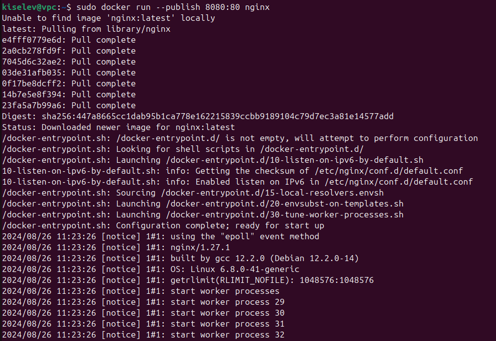

# Getting to know Docker

## Introduction

Docker is a platform for the rapid development, deployment, testing and launch of applications in containers.

All necessary documentation and instructions for use can be obtained on the official website: https://www.docker.com/

## Docker Architecture

The best way to get started with Docker is to analyze the architecture. The following scheme will help us with this:


The main components of the Docker architecture are:

- Docker Engine: The main component that manages the Docker environment. It is responsible for creating, running, and managing containers.
- Docker Daemon: The background service that runs on the host machine. It communicates with the Docker Engine to manage containers.
- Docker Client: The command-line interface (CLI) tool that allows users to interact with the Docker environment. It is installed on the host machine and communicates with the Docker Daemon.
- Docker Registry: A central repository for storing Docker images. It allows users to share and distribute Docker images.
- Docker Swarm: A cluster management tool that allows users to create, manage, and scale Docker Swarm clusters. It is based on Docker Engine.
- Docker Compose: A tool for defining and running multi-container applications. It allows users to define and run multiple Docker containers as a single application.

## Docker Basics

Docker is a powerful tool that allows users to create, deploy and manage applications using containers. In this section, we will go through some basic concepts of Docker.

### Docker Images

Docker images are the blueprint or template for creating Docker containers. They contain everything needed to run an application, including the operating system, runtime, and all the dependencies required to run the application.

### Docker Containers

Docker containers are the instances of Docker images. They are created from Docker images and run in isolation from other containers. Containers are lightweight, portable, and self-sufficient.

### Docker Volumes

Docker volumes are storage volumes that can be attached to containers. They are used to store and share data between containers.

### Docker Networks

Docker networks are logical networks that connect Docker containers. They allow containers to communicate with each other and share resources.

### Docker Swarm

Docker Swarm is a cluster management tool that allows users to create, manage, and scale Docker Swarm clusters. It is based on Docker Engine.

### Docker Compose

Docker Compose is a tool for defining and running multi-container applications. It allows users to define and run multiple Docker containers as a single application.

## Conclusion

Docker is a powerful tool that allows users to create, deploy and manage applications using containers. It is a great choice for developers who want to automate the deployment and management of their applications. Docker provides a wide range of features and tools that make it easy to develop, deploy, and scale applications.

## Installing Docker on Ubuntu

To install Docker on Ubuntu, follow these steps:
For other operating systems, you can get Docker here: https://docs.docker.com/get-docker/

1. Open the terminal.
2. let's install the necessary set of dependencies:

```
kiselev@vpc:~$ sudo apt-get install \
ca-certificates \
curl \
gnupg \
lsb-release
```

3. The next step is to add keys:

```
kiselev@vpc:~$ sudo mkdir -p /etc/apt/keyrings
curl -fsSL https://download.docker.com/linux/ubuntu/gpg |
sudo gpg --dearmor -o /etc/apt/keyrings/docker.gpg
```

4. And finally, let's add a repository:

```
kiselev@vpc:~$ echo \
"deb [arch=$(dpkg --print-architecture)
signed=/etc/apt/keyrings/docker.gpg]
https://download.docker.com/linux/ubuntu \
$(lsb_release -cs) stable" | sudo tee
/etc/apt/sources.list.d/docker.list > /dev/null
```

5. let's install a set of necessary components:

```
kiselev@vpc:~$ sudo apt-get install docker-ce docker-ce-cli containerd.io
docker-compose-plugin
```

6. It's quite simple to check the work - run the command:

```
kiselev@vpc:~$ sudo docker run hello-world
```

The output should be similar to this:

```
Hello from Docker!
This message shows that your installation appears to be working correctly.

To generate this message, Docker took the following steps:
 1. The Docker client contacted the Docker daemon.
 2. The Docker daemon pulled the "hello-world" image from the Docker Hub.
    (amd64)
 3. The Docker daemon created a new container from that image which runs the
    executable that produces the output you are currently reading.
 4. The Docker daemon streamed that output to the Docker client, which sent it
    to your terminal.

To try something more ambitious, you can run an Ubuntu container with:
 $ docker run -it ubuntu bash

Share images, automate workflows, and more with a free Docker ID:
 https://hub.docker.com/

For more examples and ideas, visit:
 https://docs.docker.com/get-started/
```

Let's assume that we only need to download the image, but not expand the container. To do this, use the docker pull ubuntu command. As you can see, the docker started downloading a version of the image with the latest tag (the last available one) because I did not set a tag for the image. Now let's specify the tag and download ubuntu version 18.04.

```
kiselev@vpc:~$ docker pull ubuntu:18.04
```


Let's launch something more serious. For example, ubuntu. We have
already downloaded it: docker run -it ubuntu bash. Now let's deal with the command: the first
half says that you need to run the container from the ubuntu image. The -it flag
indicates that you need to run the container interactively (not in
the background), and the bash postscript tells you which command from the container
needs to be run to work. In particular, you can run
the bash or shell command interpreter and thus stay working inside the container.
If, for example, we run docker run -it ubuntu date, the system will simply
display the current date and time to us and shut down the container.

We will launch a container with a specific version that we downloaded:

```
kiselev@vpc:~$ docker run -it ubuntu:18.04
```


Let's now display a list of available images in the docker images system. Here you can see that several
images are available in the system, which may differ in tags (and, accordingly, versions).

```
kiselev@vpc:~$ docker images
```


Now let's make the ports public. That is, we will make the container accessible from the outside (similar to NAT for routers). This time we will launch the nginx container, as it will immediately allow you to output docker run --publish 8080:80 nginx data.

```
kiselev@vpc:~$ sudo docker run --publish 8080:80 nginx
```



So we told the system to open port 80 from inside the container and make it accessible from the outside via port 8080. Let's check that everything works with the curl command.

We will see a greeting in the browser window:


```
kiselev@vpc:~$ curl 127.0.0.1:8080
```


As you can see, nginx has started. In one window, we received a response from him, and in
the other, a log stating that a request was made to the system.

Let's now display a list of available containers in the docker container ls system.

```
kiselev@vpc:~$ docker ps
```


The output shows that the container with the name ubuntu is running.

Let's now stop the container. To do this, we can access the container by id:

```
kiselev@vpc:~$ docker stop 8b58b5781e79
8b58b5781e79
```

And now we can remove it:

```
kiselev@vpc:~$ docker rm 8b58b5781e79
8b58b5781e79
```

The container was removed.

To delete all containers that are not running at the moment, you can use the command:

```
kiselev@vpc:~$ docker rm $(docker ps -a -q)
```


We can also delete all containers, including those launched using the --force flag:

```
kiselev@vpc:~$ docker rm -f $(docker ps -a -q) --force
```

As a result, the system listed all the container IDs that were deleted.

That's it! We have successfully installed Docker on Ubuntu and used it to run a container.

Let's say another option: your application consists of many containers with software of various versions. After fixing a number of errors, you need to clean the system by deleting all images downloaded locally. You can delete one at a time, or you can just delete everything at once:

```
kiselev@vpc:~$ docker rmi$(docker images -aq)
```

The output shows that the images were deleted.

If a shared folder is needed between the host system and the system inside the container, you can use communication via /otherway. For example, you can create a folder on the host system and then mount it to the container:

```
kiselev@vpc:~$ sudo mkdir /doc
kiselev@vpc:~$ sudo mkdir /doc/folder
docker run -it -h testcontainer --name testcontainer -v /doc/folder:/otherway ubuntu
```

Let's check the presence of the folder:

```
root@testcontainer:/# ls
```


Such a folder was created in the created container and now let's try to write a file to it.

```
root@testcontainer:/# echo "Hello, world!" > /otherway/test.txt
```

Let's exit the container and try to find the created file in the previously created folder /doc/folder:

```
kiselev@vpc:~$ sudo cat /doc/folder/test.txt
```

## Basic Docker Commands

The following is a list of some of the most common Docker commands:

- docker images: Lists the Docker images that are stored locally.
- docker run: Creates a new container from a Docker image.
- docker ps: Lists all running containers.
- docker stop: Stops a running container.
- docker rm: Removes a stopped container.
- docker rmi: Removes a Docker image.

you can also use commands and flags to perform specific operations with Docker containers and images:

- docker run -it --name my-running-container -p 8080:80 -v /path/to/data:/data my-image
- docker stop my-running-container
- docker rm my-running-container
- docker rmi my-image
