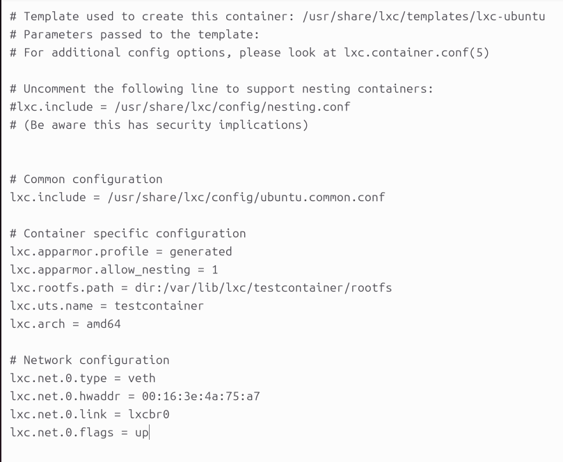

# Containers and LXC

# Install LXC and create a new container

```
kiselev@vpc:~$ sudo apt-get install lxc debootstrap bridge-utils lxc-templates
kiselev@vpc:~$ sudo lxc-create -n testcontainer -t ubuntu
kiselev@vpc:~$ sudo lxc-start -d -n test_container
```

The first command installs the necessary packages through the package manager. She also sets up a set “blanks" - templates. In fact, these are images of operating systems that can be used in the future. From here we need an ubuntu image.

The second creates a container named testcontainer from the ubuntu image, and the configuration file is also specified.

```
##
# The default user is 'ubuntu' with password 'ubuntu'!
# Use the 'sudo' command to run tasks as root in the container.
##
```

The third command starts the container in daemon mode (flag -d).

To make sure that the container has actually been created and is working, you can connect to it and see how and what happens:

```
kiselev@vpc:~$ lxc-attach -n testcontainer
```


Next, we suggest looking at the changes in the folder:

```
kiselev@vpc:~$ ls /sys/fs/cgroup
```

Folders related directly to our site have appeared to the container:

```
kiselev@vpc:~$ ll /sys/fs/cgroup/
```


You can allocate and limit resources either directly - through the files described above, or through
special lxc commands:

```
sudo nano /var/lib/lxc/testcontainer/config
```



Various parameters can be added to this file. For example:

```
lxc.cgroup2.memory.max = 256M
lxc.start.auto = 1
```

The first line limits the memory to 256M.

You can check this inside the container with the free -m command


The second line starts the container automatically.

```
kiselev@vpc:~$ sudo sudo lxc-ls --fancy
```


At this stage, questions may arise, since there is a lot of literature and manuals on the Internet that suggest limiting containers in a slightly different way:

```
kiselev@vpc:~$ memory.limit_in_bytes 400
```

Various parameters can be added to this file. For example:The container will automatically start when the system starts.

You can check this with the command:

```
kiselev@vpc:~$ lxc-ls -f
```

The container is now in the shell. You can now add the necessary packages to the container:

```
kiselev@vpc:~$ apt-get update
kiselev@vpc:~$ apt-get install nginx
```

```
kiselev@vpc:~$ lxc-stop -n testcontainer
kiselev@vpc:~$ lxc-destroy -n testcontainer
```

The first command stops the container. The second command deletes the container.

```
kiselev@vpc:~$ lxc-start -n testcontainer
```
