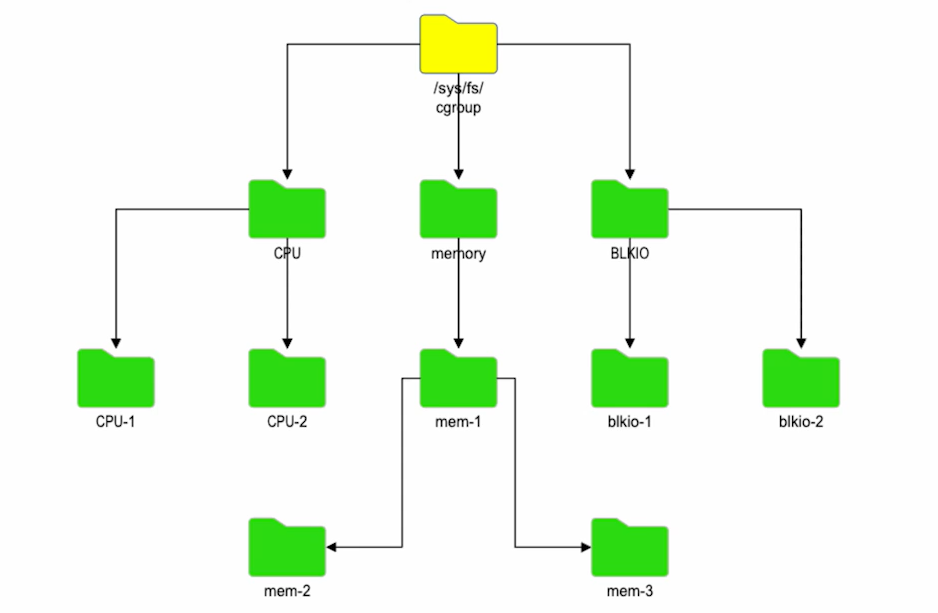
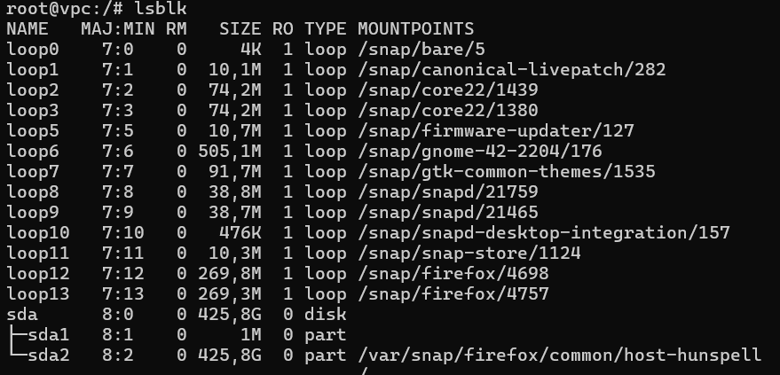
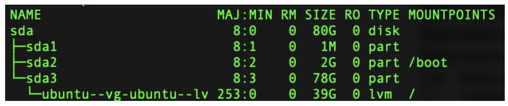

# Mechanisms of control groups

The mechanism consists of two main parts: the core (cgroup core) and subsystems.
The list of subsystems depends on the kernel version. The main components are as follows:

- The blkio subsystem sets quotas for reading and writing from block devices.
- cpuacct — generates reports on the use of processor resources.
- cpu — provides access to the resources of the processor subsystem to the processes within the control group.
- cpuset — distributes tasks within the control group among the available processor cores.
- devices — provides access or, conversely, blocks access to devices.
- freezer — suspends and resumes the execution of tasks within the control group.
- memory — allocates memory for process groups.
- net_cls — marks network packets with a special tag, which further allows you to identify packets generated by a specific task within the control group.
- netprio — used to dynamically set traffic priorities.
- ns is used to group processes into a separate namespace where processes can interact with each other and at the same time be isolated from external processes.
- pids — used to limit the number of processes within the control group.
- unified — automatically mounts the file system to the /sys/fs/cgroup/unified directory at system startup.

Subsystems are kernel modules, each of which is responsible for allocating system resources to control groups. Of course, subsystems can be individually programmed in order to create an individual approach to managing process groups. The programming interface is documented in the file: https://www.kernel.org/doc/Documentation/cgroup-v1/cgroups.txt



State objects can contain subsystem parameters for each control group and are represented as pseudo-files in a virtual file system. We'll talk about them later.

Each subsystem is a directory with a set of control files, in which all settings are written.

In addition to specialized files, each directory contains a set of control files:

- cgroup.clone_children — allows you to transfer parent properties to child control groups.
- tasks — contains a list of the PIDs of all processes included in the control groups.
- cgroup.procs — contains a list of TGID (Thread Group Id) process groups included in control groups.
- cgroup.event_control — allows you to send notifications in case of a change in the status of the control group.
- release_agent — contains a command that will be executed if the notify_on_release option is enabled. It can be used, for example, to automatically delete empty control groups.
- notify_on_release — contains a Boolean variable (0 or 1) that enables (or, conversely, disables) execution of the command specified in release_agent.

Before considering each subsystem separately, we introduce the definition of a pseudo-file.

A pseudo-file is a file that does not represent a file in the underlying file system on disk. These are files that are automatically created for representation of some other object in the form of a file in order to be able
to interact with it. A simple example of /dev/sda.

## blkio (block I/O)

blkio is a subsystem for managing the I/O procedures of block devices. To restrict access to an application or process, values are written to pseudo-files. The subsystem contains a huge number of parameters.

It is proposed to consider the most important:

- blkio.weight - allows you to determine the relative weight (in values from 100 to 1000) of the input/output of the control group. In this case, the higher the value, the more resources the application or process will receive. The analogy can be quite simple: with a value of 100, the application will be able to perform 100 read/write operations per second. You can define an additional value for individual devices in a separate pseudo-file: blkio.weight_device. An example of defining a parameter in a pseudo-file looks like this:

```
echo 200 > blkio.weight
```

- blkio.weight_device - defines the relative weight for a specific device that is available in the file system. This parameter allows you to override the total value of blkio.weight. The override looks like this:

```
echo 8:0 200 > blkio.weight_device
```

The conclusion is this due to the fact that the device /dev/sda corresponds to the number 8:0 in the list of devices. You can check this using the lsblk command:

```
lsblk
```



As you can see, the values we enter match the values output by the system.

### cpu

This subsystem is responsible for controlling the access of control groups to the processors of the system. Access is regulated by parameters, which, as in the previous case, are recorded in pseudo-files. The principle is the same: one parameter is one pseudo-file. Let's consider the most significant:

- cpu.shares is an integer parameter that determines the relative amount of available processor time. For example: there are two control groups. For one of them, this value is equal to one, for the second - 2. This means that the processes from the second control group will receive twice as much processor time when performing a particular task.
- cpu_rt_runtime_us - this parameter defines the maximum period of time (in microseconds) during which tasks of a
  process can use processor resources. This parameter is very important, since this restriction allows you to prevent the exclusive use of resources by one subgroup.
- cpu.\_rt_period_us - the interval is also determined here, after which applications from the control group will have access to processor resources.
  The example is quite simple: if we need processes from a group to have access to a processor with a length of 5 seconds every 10 seconds, we need to set the following values:

```

cpu.rt_runtime_us 4000000
cpu.rt_period_us 10000000

```

### cpuacct

This subsystem generates reports on the utilization of processor resources. There are three types of reports in total:

- cpuacct.stat - this report returns the number of processor cycles (the measurement value is USER_HZ) that were spent processing the tasks of the control group. User and system mode are taken into account.
- cpuacct.usage - returns the total time (unit of measurement - nanoseconds) during which processor resources were occupied with processing tasks of the control group.
- cpuacct.usage_percpu - like the previous report, it returns the time during which resources were busy processing all tasks of the control group, but processor-by-processor.

### cpuset

The subsystem responsible for allocating processor resources to control groups. Also, as before, each parameter is stored in a separate pseudo-file.

For example:

- cpuset.cpus is a parameter that determines the number of processors that processes in the control group can access. You can write to the file both the range of processors used (0-2) and some separate ones separated by commas. Example: if a number is written in the file (for simplicity, 0), then the application will only have access to this processor. The rest will not be used for this task. It is important to note that the
  same processor can be used to solve other tasks. If we want it to be used only to solve our problem,
  use the following parameter.
- cpuset.cpu_exclusive - this parameter can be used to set the possibility of sharing processors that were listed earlier.

### devices

This subsystem is responsible for managing access to devices. It has been included in the Linux OS relatively recently, unlike those previously considered, and has the fewest possible parameters:

- devices.allow - devices that are allowed access within the control group are written to this pseudo-file. Each record contains four fields: device type, senior number, junior number, access mode. At first glance, it seems that everything is complicated, but no. Let 's look at each field with examples:
  - the type of device. The following values can be used here:
    - a - applies to all character and block devices
    - b - block device
    - c - character device (link to the device, to the file)
  - The major and minor numbers are separated by a colon and identify the target device in the Linux OS. For example, the value 8:1 indicates the following:
    - 8 is the senior number indicating SCSi disks
    - 1 is the junior number indicating the first partition on the first disk
      Obviously, we have already seen this example before, but now we can refresh our memory:
      
  - access mode - access to the device that the control group will have is determined, the following options are available:
    - r - read-only access
    - w - read and write access
    - m - permission to create files if they do not exist
- devices.deny is the exact opposite of the previous option. Prohibits access to devices. The recording format is identical to the previous one.
- devices.list - this pseudo-file will contain devices for which access control has been configured

### freezer

It may be clear from the name that this subsystem is responsible for stopping and resuming the tasks of the control group. It has only one file:

- freezer.state - subsystem status. It has several acceptable values:
  - frozen - tasks are suspended
  - freezing - the system is in the stage of suspending tasks
  - thawed - resuming the work of tasks in the group

Important note: only two values can be written to the file: frozen and thawed. The freezing value cannot be written and the system writes it to the file itself. This state is a transitional one for the process.

### memory

The subsystem generates reports on the use of RAM resources. It also allows you to impose restrictions using a number of parameters. Let's consider a few:

- memory.stat - returns memory usage statistics.
- memory.usage_in_bytes - displays the total size of the memory that is occupied by the processes of the control group.
- memory.max_usage_in_bytes - the maximum amount of memory available to the processes of the control group.
- memory.limit_in_bytes - here you can set the maximum memory size, including the swap file.
- memory.failcnt - this file is a counter for cases when the limit is reached, which is set in memory.limit_in_bytes.

### net_cls

This subsystem is responsible for managing the network classes of the control group. It has only one file:

- net_cls.classid - this file contains the ID of the network class that is assigned to the control group. The format of the file is as follows:

```

net_cls.classid 1:1:1000000000000000000000000000000000000000000000000000000000000000

```

The first field is the name of the file, the second field is the ID of the network class, and the third field is the number of the control group. The format of the file is as follows:

```

net_cls.classid 1:1:1000000000000000000000000000000000000000000000000000000000000000

```

### perf_events

This subsystem is responsible for generating reports on the utilization of the CPU. It has only one file:

- perf_events.max_sample_rate - this file contains the maximum value of the CPU utilization.

### pids

This subsystem is responsible for managing the number of processes in the control group. It has only one file:

- pids.current - this file contains the current number of processes in the control group.

### ptmx_t

This subsystem is responsible for managing the pseudo-terminals. It has only one file:

- ptmx.uid - this file contains the user ID of the control group.

### rdma_cm

This subsystem is responsible for managing the RDMA communication. It has only one file:

- rdma_cm.device - this file contains the name of the RDMA device.

### rdma_cm_t

This subsystem is responsible for managing the RDMA communication. It has only one file:

- rdma_cm.device - this file contains the name of the RDMA device.

### rdma_cm_t_group

This subsystem is responsible for managing the RDMA communication. It has only one file:

- rdma_cm.device - this file contains the name of the RDMA device.

### rdma_cm_t_group_device_t

This subsystem is responsible for managing the RDMA communication. It has only one file:

- rdma_cm.device - this file contains the name of the RDMA device.

### scheding_group

This subsystem is responsible for managing the scheduling group. It has only one file:

- scheding_group.cpus - this file contains the list of processors that the control group can use.

### selinux

This subsystem is responsible for managing the SELinux policy. It has only one file:

- selinux.enforce - this file contains the SELinux policy that is applied to the control group.

### smp

This subsystem is responsible for managing the SMP. It has only one file:

- smp.cpus - this file contains the list of processors that the control group can use.

### sysctl

This subsystem is responsible for managing the system parameters. It has only one file:

- sysctl.net.core.somaxconn - this file contains the maximum number of connections that a process can have.

### uptime

This subsystem is responsible for generating reports on the system uptime. It has only one file:

- uptime - this file contains the system uptime.

### users

This subsystem is responsible for managing the users. It has only one file:

- users.allow - this file contains the list of users that are allowed to use the control group.
- users.deny - this file contains the list of users that are prohibited from using the control group.

### user_control

This subsystem is responsible for managing the control group. It has only one file:

- user_control.uid - this file contains the user ID of the control group.

### user_cpu

This subsystem is responsible for managing the CPU. It has only one file:

- user_cpu.stat - this file contains the number of processor cycles (the measurement value is USER_HZ) that were spent processing the tasks of the control group. User and system mode are taken into account.
- user_cpu .time - this file contains the total time (unit of measurement - nanoseconds) during which the tasks of the control group were processed.
- user_cpu.usage_in_user_jiffies - this file contains the number of processor cycles that were spent processing the tasks of the control group. User and system mode are taken into account.
- user_cpu.usage_in_system_jiffies - this file contains the number of processor cycles that were spent processing the tasks of the control group. User and system mode are taken into account.
- user_cpu.usage_in_user_seconds - this file contains the number of seconds that were spent processing the tasks of the control group. User and system mode are taken into account.
- user_cpu.usage_in_system_seconds - this file contains the number of seconds that were spent processing the tasks of the control group. User and system mode are taken into account.
- user_cpu.max_usage_in_user_jiffies - this file contains the maximum number of processor cycles that were spent processing the tasks of the control group. User and system mode are taken into account.
- user_cpu.max_usage_in_system_jiffies - this file contains the maximum number of processor cycles that were spent processing the tasks of the control group. User and system mode are taken into account.
- user_cpu.max_usage_in_user_seconds - this file contains the maximum number of seconds that were spent processing the tasks of the control group. User and system mode are taken into account.
- user_cpu.max_usage_in_system_seconds - this file contains the maximum number of seconds that were spent processing the tasks of the control group. User and system mode are taken into account.
- user_cpu.system_time - this file contains the total time (unit of measurement - nanoseconds) during which the tasks of the control group were processed.
- user_cpu.user_time - this file contains the total time (unit of measurement - nanoseconds) during which the tasks of the control group were processed.
- user_cpu.max_usage_in_user_jiffies - this file contains the maximum number of processor cycles that were spent processing the tasks of the control group. User and system mode are taken into account.
- user_cpu.max_usage_in_system_jiffies - this file contains the maximum number of processor cycles that were spent processing the tasks of the control group. User and system mode are taken into account.
- user_cpu.max_usage_in_user_seconds - this file contains the maximum number of seconds that were spent processing the tasks of the control group. User and system mode are taken into account.
- user_cpu.max_usage_in_system_seconds - this file contains the maximum number of seconds that were spent processing the tasks of the control group. User and system mode are taken into account.
- user_cpu.system_jiffies - this file contains the number of processor cycles that were spent processing the tasks of the control group. User and system mode are taken into account.
- user_cpu.user_jiffies - this file contains the number of processor cycles that were spent processing the tasks of the control group. User and system mode are taken into account.
- user_cpu.max_usage_in_user_jiffies - this file contains the maximum number of processor cycles that were spent processing the tasks of the control group. User and system mode are taken into account.
- user_cpu.max_usage_in_system_jiffies - this file contains the maximum number of processor cycles that were spent processing the tasks of the control group. User and system mode are taken into account.
- user_cpu.max_usage_in_user_seconds - this file contains the maximum number of seconds that were spent processing the tasks of the control group. User and system mode are taken into account.
- user_cpu.max_usage_in_system_seconds - this file contains the maximum number of seconds that were spent processing the tasks of the control group. User and system mode are taken into account.
- user_cpu.system_seconds - this file contains the total time (unit of measurement - nanoseconds) during which the tasks of the control group were processed.
- user_cpu.user_seconds - this file contains the total time (unit of measurement - nanoseconds) during which the tasks of the control group were processed.
- user_cpu.max_usage_in_user_jiffies - this file contains the maximum number of processor cycles that were spent processing the tasks of the control group. User and system mode are taken into account.
- user_cpu.max_usage_in_system_jiffies - this file contains the maximum number of processor cycles that were spent processing the tasks of the control group. User and system mode are taken into account.
- user_cpu.max_usage_in_user_seconds - this file contains the maximum number of seconds that were spent processing the tasks of the control group. User and system mode are taken into account.
- user_cpu.max_usage_in_system_seconds - this file contains the maximum number of seconds that were spent processing the tasks of the control group. User and system mode are taken into account.
- user_cpu.system_jiffies - this file contains the number of processor cycles that were spent processing the tasks of the control group. User and system mode are taken into account.
- user_cpu.user_jiffies - this file contains the number of processor cycles that were spent processing the tasks of the control group. User and system mode are taken into account.
- user_cpu.max_usage_in_user_jiffies - this file contains the maximum number of processor cycles that were spent processing the tasks of the control group. User and system mode are taken into account.
- user_cpu.max_usage_in_system_jiffies - this file contains the maximum number of processor cycles that were spent processing the tasks of the control group. User and system mode are taken into account.
- user_cpu.max_usage_in_user_seconds - this file contains the maximum number of seconds that were spent processing the tasks of the control group. User and system mode are taken into account.

### user_cpu_stat

This subsystem is responsible for managing the CPU. It has only one file:

- user_cpu.stat - this file contains the number of processor cycles (the measurement value is USER_HZ) that were spent processing the tasks of the control group. User and system mode are taken into account.
- user_cpu.time - this file contains the total time (unit of measurement - nanoseconds) during which the tasks of the control group were processed.
- user_cpu.usage_in_user_jiffies - this file contains the number of processor cycles that were spent processing the tasks of the control group. User and system mode are taken into account.
- user_cpu.usage_in_system_jiffies - this file contains the number of processor cycles that were spent processing the tasks of the control group. User and system mode are taken into account.
- user_cpu.usage_in_user_seconds - this file contains the number of seconds that were spent processing the tasks of the control group. User and system mode are taken into account.
- user_cpu.usage_in_system_seconds - this file contains the number of seconds that were spent processing the tasks of the control group. User and system mode are taken into account.
- user_cpu.max_usage_in_user_jiffies - this file contains the maximum number of processor cycles that were spent processing the tasks of the control group. User and system mode are taken into account.
- user_cpu.max_usage_in_system_jiffies - this file contains the maximum number of processor cycles that were spent processing the tasks of the control group. User and system mode are taken into account.
- user_cpu.max_usage_in_user_seconds - this file contains the maximum number of seconds that were spent processing the tasks of the control group. User and system mode are taken into account.
- user_cpu.max_usage_in_system_seconds - this file contains the maximum number of seconds that were spent processing the tasks of the control group. User and system mode are taken into account.

### user_cpu_stat_per_user

This subsystem is responsible for managing the CPU. It has only one file:

- user_cpu.stat - this file contains the number of processor cycles (the measurement value is USER_HZ) that were spent processing the tasks of the control group. User and system mode are taken into account.
- user_cpu.time - this file contains the total time (unit of measurement - nanoseconds) during which the tasks of the control group were processed.
- user_cpu.usage_in_user_jiffies - this file contains the number of processor cycles that were spent processing the tasks of the control group. User and system mode are taken into account.
- user_cpu.usage_in_system_jiffies - this file contains the number of processor cycles that were spent processing the tasks of the control group. User and system mode are taken into account.

## practice

So, having studied the theory, let's move on to practice! First, let 's create a new directory in the folder:

```

mkdir /sys/fs/cgroup/cpuset/testgroup1

```

And then let's look at the list of files and directories in the folder. The conclusion
will be quite interesting:

```
# ll /sys/fs/cgroup/cpuset/testgroup1/
total 0
drwxr-xr-x 2 root root 0 Oct 27 08:51 ./
drwxr-xr-x 3 root root 0 Oct 27 08:50 ../
-r--r--r-- 1 root root 0 Oct 27 08:51 cgroup.controllers
-r--r--r-- 1 root root 0 Oct 27 08:51 cgroup.events
-rw-r--r-- 1 root root 0 Oct 27 08:51 cgroup.freeze
--w------- 1 root root 0 Oct 27 08:51 cgroup.kill
-rw-r--r-- 1 root root 0 Oct 27 08:51 cgroup.max.depth
-rw-r--r-- 1 root root 0 Oct 27 08:51 cgroup.max.descendants
-rw-r--r-- 1 root root 0 Oct 27 08:51 cgroup.procs
-r--r--r-- 1 root root 0 Oct 27 08:51 cgroup.stat
-rw-r--r-- 1 root root 0 Oct 27 08:51 cgroup.subtree_control
-rw-r--r-- 1 root root 0 Oct 27 08:51 cgroup.threads
-rw-r--r-- 1 root root 0 Oct 27 08:51 cgroup.type
-rw-r--r-- 1 root root 0 Oct 27 08:51 cpu.pressure
-r--r--r-- 1 root root 0 Oct 27 08:51 cpu.stat
-rw-r--r-- 1 root root 0 Oct 27 08:51 io.pressure
-rw-r--r-- 1 root root 0 Oct 27 08:51 memory.pressure
```

As you can see, a set of files was immediately created along with the directory. But not only that! By creating a directory along this path, we also created a control group, which was immediately initialized, creating a set of files.

Let's look at the content of these files:

In addition to just creating files (they are also pseudo-files), they are immediately
filled with information:

```
# cat /sys/fs/cgroup/cpuset/testgroup1/cpu.stat
usage_usec 0
user_usec 0
system_usec 0
```

```
# cat /sys/fs/cgroup/cpuset/testgroup1/cpu.pressure
some avg10=0.00 avg60=0.00 avg300=0.00 total=0
full avg10=0.00 avg60=0.00 avg300=0.00 total=0
```

- cpu.pressure - this file contains the pressure on the CPU. The value is a percentage, where 0 means that the CPU is not overloaded and 100 means that the CPU is overloaded.
- cpu.stat - this file contains the number of processor cycles (the measurement value is USER_HZ) that were spent processing the tasks of the control group. User and system mode are taken into account.
- io.pressure - this file contains the pressure on the I/O subsystem. The value is a percentage, where 0 means that the I/O is not overloaded and 100 means that the I/O is overloaded.
- memory.pressure - this file contains the pressure on the memory. The value is a percentage, where 0 means that the memory is not overloaded and 100 means that the memory is overloaded.
- user_cpu.stat - this file contains the number of processor cycles (the measurement value is USER_HZ) that were spent processing the tasks of the control group. User and system mode are taken into account.
- user_cpu.time - this file contains the total time (unit of measurement - nanoseconds) during which the tasks of the control group were processed.
- user_cpu.usage_in_user_jiffies - this file contains the number of processor cycles that were spent processing the tasks of the control group. User and system mode are taken into account.
- user_cpu.usage_in_system_jiffies - this file contains the number of processor cycles that were spent processing the tasks of the control group. User and system mode are taken into account.

Here we can already see the values and figures we have studied in the theoretical part. At a minimum, the statistics files on PROCESSOR utilization are visible.

We can go further and look at the information about the process performed by our current command shell. To do this, run the following command:

```
# cat /proc/$$/status | grep 'allowed'
Cpus_allowed: 2
Cpus_allowed_list: 0-1
Mems_allowed:
00000000,00000000,00000000,00000000,00000000,00000000,00000000,00
000000,00000000,00000000,00000000,00000000,00000000,00000000,0000
0000,00000000,00000000,00000000,00000000,00000000,00000000,000000
00,00000000,00000000,00000000,00000000,00000000,00000000,00000000
,00000000,00000000,00000001
Mems_allowed_list: 0
```

This command gives us information about the processes that are allowed to use the CPU.

```
# cat /proc/$$/status | grep 'Cpu(s)'
Cpu(s): 0.0%us, 0.0%sy, 0.0%ni, 100.0%id, 0.0%wa, 0.0%hi, 0.0%si, 0.0%st
```

This command gives us information about the CPU usage of the current process.

```
# cat /proc/$$/status | grep 'Threads'
Threads: 1
```

This command gives us information about the number of threads.

```
# cat /proc/$$/status | grep 'VmRSS'
VmRSS: 0 kB
```

This command gives us information about the memory usage of the current process.
